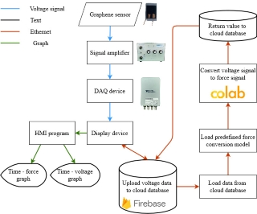

# Background
Graphene sensors can be utilized in many areas, such as force measurement or vibration measurement.
However, current measuremnt method is connect the graphene sensor to an oscilloscope, which is not a ideal way for data sharing or remote visualization. Not even mention the oscilloscope has no capability for date post-processing.
# Proposed Method
Our proposed method is connect the graphene sensor to a DAQ device (data acquisition) and combine it to a laptop or any embeded system with ethernet ability. The system will upload the force data to Google Cloud Firebase database and the data can be manipulated afterward.
# Flowchart
!
# Setup
## For the Firebase database
1. Setup your Google account and link it to Google Cloud Firebase
2. Get Firebase credential JSON file and your database URL
3. Replace your own credential to the `db_config` part in the main program
## For the env
```
pip install pyrebase4
pip install firebase_admin
pip install matplotlib
pip install nidaqmx
```